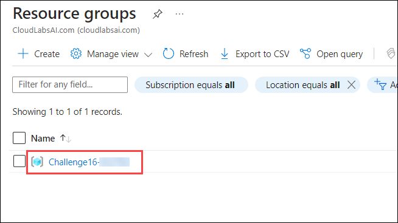
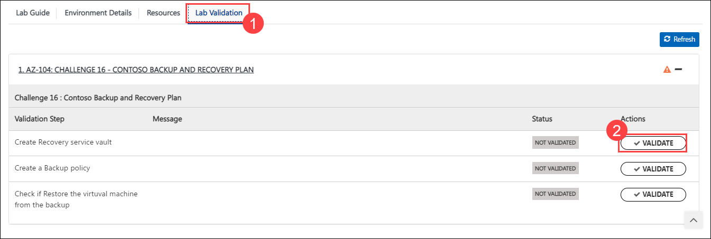
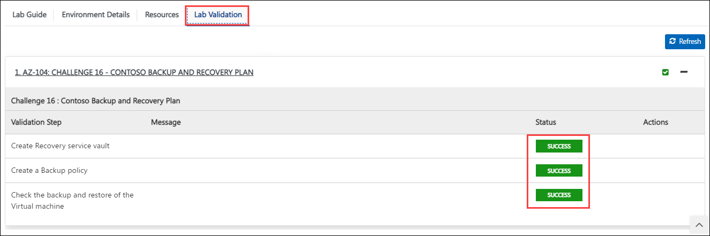
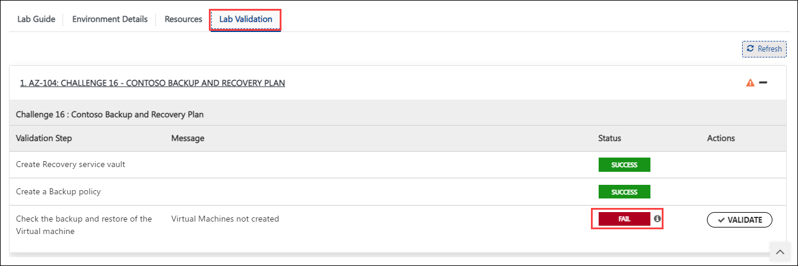
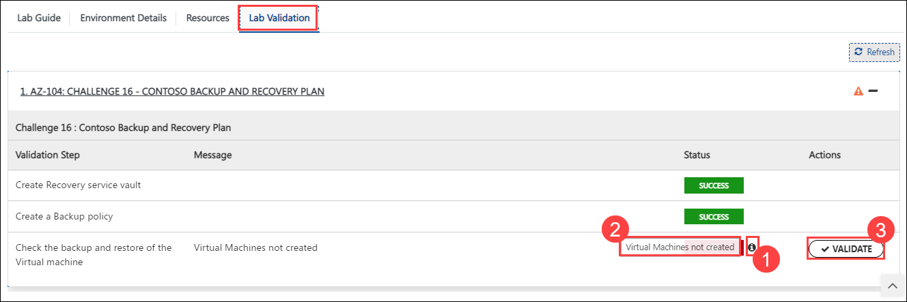

## Challenge 16 : Contoso Backup and Recovery Plan

### **Contoso Environment:** 

1. The Contoso environment consists of an Azure **subscription** with **contributor** permissions, a pre-configured Contoso virtual machine with the name **Contosovm<inject key="DeploymentID" enableCopy="false"/>**, and a resource group with the name **Challenge16-<inject key="DeploymentID" enableCopy="false"/>**.

1. To access the Azure portal, open a private/incognito window in your browser and navigate to **[Azure Portal](https://portal.azure.com)**.

1. On the **Sign in to Microsoft Azure** tab you will see a login screen, enter the following email/username and then click on **Next**. 
   * Email/Username: <inject key="AzureAdUserEmail"></inject>
   
     
     
1. Now enter the following password and click on **Sign in**.
   * Password: <inject key="AzureAdUserPassword"></inject>
   
     
     
1. If you see the pop-up **Stay Signed in?**, click No

1. If you see the pop-up **You have free Azure Advisor recommendations!**, close the window to continue the lab.

1. If a **Welcome to Microsoft Azure** popup window appears, click **Maybe Later** to skip the tour.
   
1. Now you will see Azure Portal Dashboard, click on **Resource groups** from the Navigate panel to see the resource groups.

    
   
1. Confirm you have a resource group **Challenge16-<inject key="DeploymentID" enableCopy="false"/>** present as shown in the below screenshot. You need to use the **Challenge16-<inject key="DeploymentID" enableCopy="false"/>** resource group through out the challenge.

    
   

### **Level:**  Intermediate

### **Challenge Objective:**

#### Contoso is a company that relies heavily on its data to run its business. As an Azure Administrator, your team has been tasked with setting up a backup and recovery plan for Contoso's critical data. The requirements are as follows:

1. Create an Azure Recovery Services vault to store backups of Contoso's virtual machines.

1. Create a backup policy that performs daily backups at 11:00 PM and retains backups for 30 days.

1. Configure a virtual machine to be backed up by the backup policy.

1. Perform a backup and verify that the backup was successful.

1. Restore the virtual machine from the backup and verify that the restore was successful.

### Success Criteria:

1. The Recovery Services vault is successfully created.

1. The backup policy is successfully configured and performs a backup of the virtual machine.

1. The backup and restore operations are successful and the virtual machine is fully restored to its original state.

### Lab Validation

1. After completing the challenge, you need to visit the **Lab Validation (1)** tab and click on the **VALIDATE (2)** button under Actions to perform the validation steps. Verify that you have met the success criteria of the challenge. 

    

1. If the validation status displays **Success** for all the validation steps, **congratulations!**. This means that you have successfully completed the challenge. 

     
     
1. If the validation status displays **Fail**, **don't worry!** This could mean that you did not perform the challenge correctly.

     

1. Hover your mouse over the `i` **(1)** icon to see the error message and determine the root cause of the failure. Based on the error message, revisit the challenge as necessary, and redo the validation by clicking on the **VALIDATE (3)** button again.
      
      

1. If you are still having trouble, you can reach out to the support team via `labs-support@spektrasystems.com` for further assistance. The support team is available to help you to troubleshoot and resolve any technical issues or validation issues that may arise while the lab environment is live.

