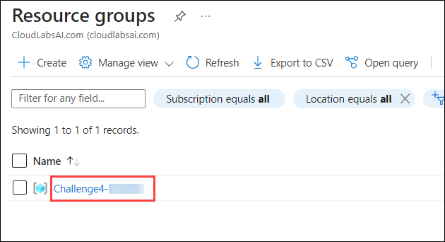
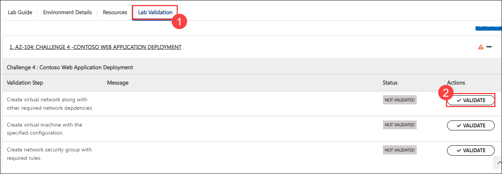
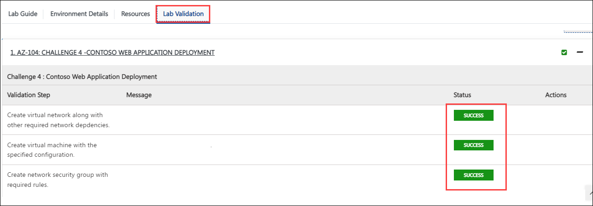
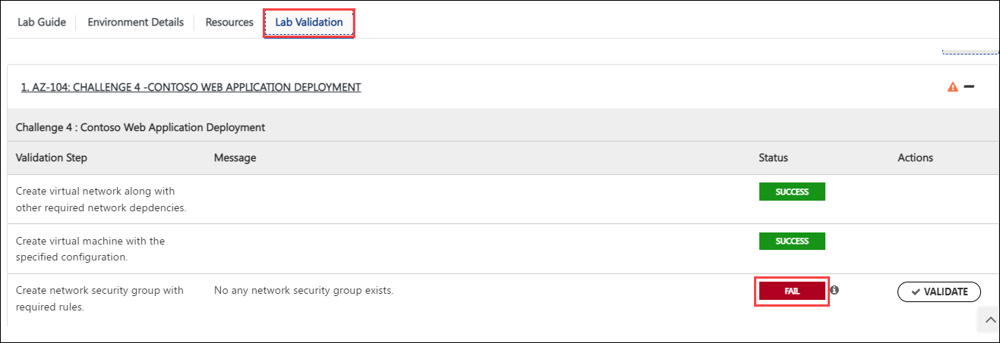
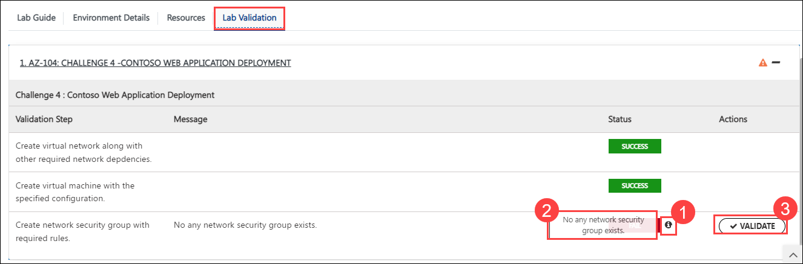

## Challenge 4 : Contoso Web Application Deployment

### **Contoso Environment:** 

1. The Contoso environment consists of an Azure **subscription** with **contributor** permissions and a resource group with the name **Challenge4-SUFFIX**.

1. To access the Azure portal, open a private/incognito window in your browser and navigate to **[Azure Portal](https://portal.azure.com)**.

1. On the **Sign in to Microsoft Azure** tab you will see a login screen, enter the following email/username and then click on **Next**. 
   * Email/Username: <inject key="AzureAdUserEmail"></inject>
   
     
     
1. Now enter the following password and click on **Sign in**.
   * Password: <inject key="AzureAdUserPassword"></inject>
   
     
     
1. If you see the pop-up **Stay Signed in?**, click No

1. If you see the pop-up **You have free Azure Advisor recommendations!**, close the window to continue the lab.

1. If a **Welcome to Microsoft Azure** popup window appears, click **Maybe Later** to skip the tour.
   
1. Now you will see Azure Portal Dashboard, click on **Resource groups** from the Navigate panel to see the resource groups.

    
   
1. Confirm you have a resource group **Challenge4-SUFFIX** present as shown in the below screenshot. You need to use the **Challenge4-SUFFIX** resource group through out the challenge.

    
    

### **Level:** Advanced 

### **Challenge Objective:**

#### Contoso is a web application development company that needs to deploy a new web application in Azure. The web application has the following requirements:

1. The application must run on a Windows Server 2019 virtual machine.

1. The virtual machine must have 2 cores and 8 GB RAM.

1. The virtual machine must have a data disk with a size of 128 GB.

1. The virtual machine must be deployed to the East US region.

1. The virtual machine must be part of a virtual network with an address space of 10.0.0.0/16 and a subnet with an address space of 10.0.0.0/24.

1. The virtual machine must be accessible from the internet via port 80.
 
1. The Virtual machine must be part of an Availability set with 3 fault domain and 10 update to plan for future high availability. 

1. IIS with default page must be accessible.

#### Your challenge is to deploy this web application in Azure by using an ARM template/Azure Portal. This should include the following resources:

1. A virtual network along with other required network depdencies. 

1. A virtual machine with the specified configuration.

1. A network security group with required rules.

1. Any other dependent Azure resource, scripts etc required to meet the 
goal.

### Success Criteria:

1. The web application must be accessible from the internet via port 80.

1. The virtual machine must have the specified configuration. 

1. There should not be any other port open except required. 

### Lab Validation

1. After completing the challenge, you need to visit the **Lab Validation (1)** tab and click on the **VALIDATE (2)** button under Actions to perform the validation steps. Verify that you have met the success criteria of the challenge. 

    

1. If the validation status displays **Success** for all the validation steps, **congratulations!**. This means that you have successfully completed the challenge. 

     
     
1. If the validation status displays **Fail**, **don't worry!** This could mean that you did not perform the challenge correctly.

     

1. Hover your mouse over the `i` **(1)** icon to see the error message and determine the root cause of the failure. Based on the error message, revisit the challenge as necessary, and redo the validation by clicking on the **VALIDATE (3)** button again.
      
      

1. If you are still having trouble, you can reach out to the support team via `labs-support@spektrasystems.com` for further assistance. The support team is available to help you to troubleshoot and resolve any technical issues or validation issues that may arise while the lab environment is live.

