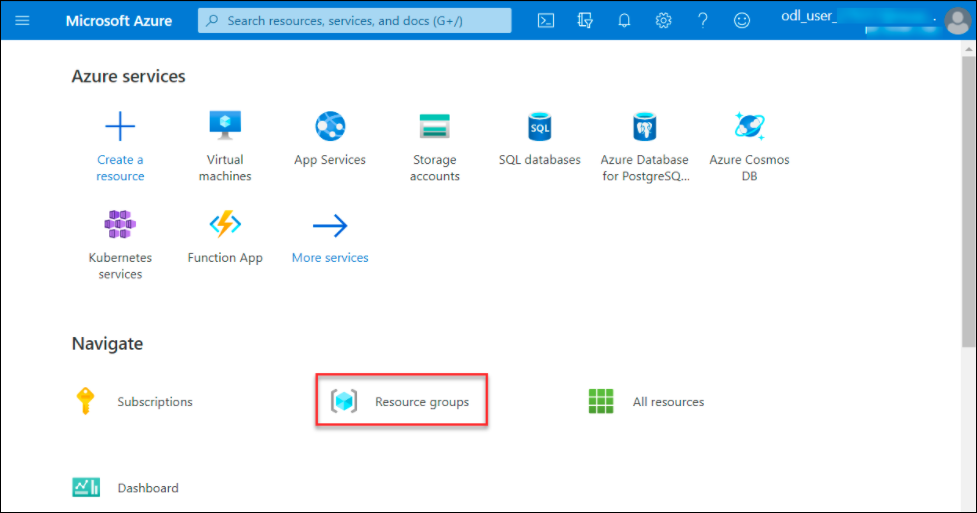

## Challenge 5 : Contoso Virtual Machine Encryption 

### **Contoso Environment:** 

1. The Contoso environment consists of an Azure **subscription** with **contributor** permissions, a pre-configured Contoso virtual machine with the name **Contosovm<inject key="DeploymentID" enableCopy="false"/>**, and a resource group with the name **Challenge5-<inject key="DeploymentID" enableCopy="false"/>**.

1. To access the Azure portal, open a private/incognito window in your browser and navigate to **[Azure Portal](https://portal.azure.com)**.

1. On the **Sign in to Microsoft Azure** tab you will see a login screen, enter the following email/username and then click on **Next**. 
   * Email/Username: <inject key="AzureAdUserEmail"></inject>
   
     
     
1. Now enter the following password and click on **Sign in**.
   * Password: <inject key="AzureAdUserPassword"></inject>
   
     
     
1. If you see the pop-up **Stay Signed in?**, click No.

1. If you see the pop-up **You have free Azure Advisor recommendations!**, close the window to continue the lab.

1. If a **Welcome to Microsoft Azure** popup window appears, click **Maybe Later** to skip the tour.
   
1. Now you will see Azure Portal Dashboard, click on **Resource groups** from the Navigate panel to see the resource groups.

    
   
1. Confirm you have a resource group **Challenge5-<inject key="DeploymentID" enableCopy="false"/>** present as shown in the below screenshot. You need to use the **Challenge5-<inject key="DeploymentID" enableCopy="false"/>** resource group through out the challenge.

    
   

### **Level:**  Advanced

### **Challenge Objective:**

#### Contoso has decided that it needs to encrypt the data on its virtual machines to comply with regulatory requirements. Your challenge is to encrypt the pre-created virtual machine named Contosovm<inject key="DeploymentID" enableCopy="false"/> in Azure by using Azure Disk Encryption.

#### The virtual machine has the following specifications:

1. The virtual machine is running Windows Server 2019.

1. The virtual machine has a data disk with a size of 32 GB.

1. The virtual machine is currently located in the East US region.

1. The virtual machine is not currently encrypted.

  >**NOTE**: Your challenge is to encrypt the virtual machine by using Azure Disk Encryption. The encryption key should be stored in Azure Key Vault.

### Success Criteria:

1. The virtual machine must be encrypted.

1. The encryption key must be stored in Azure Key Vault.

### Lab Validation

1. After completing the challenge, you need to visit the **Lab Validation (1)** tab and click on the **VALIDATE (2)** button under Actions to perform the validation steps. Verify that you have met the success criteria of the challenge. 

    

1. If the validation status displays **Success** for all the validation steps, **congratulations!** This means that you have successfully completed the challenge. 

     
     
1. If the validation status displays **Fail**, **don't worry!** This could mean that you did not perform the challenge correctly.

     

1. Hover your mouse over the `i` **(1)** icon to see the error message and determine the root cause of the failure. Based on the error message, revisit the challenge as necessary, and redo the validation by clicking on the **VALIDATE (3)** button again.
      
      

1. If you are still having trouble, you can reach out to the support team via `labs-support@spektrasystems.com` for further assistance. The support team is available to help you to troubleshoot and resolve any technical issues or validation issues that may arise while the lab environment is live.
