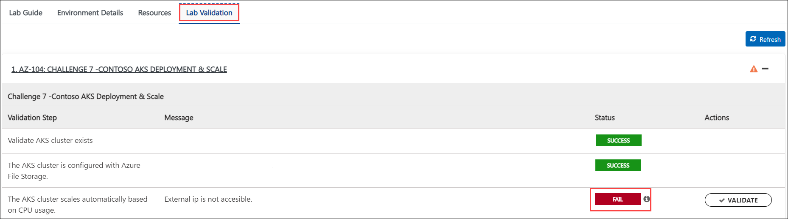

## Challenge 7 : Contoso AKS Deployment & Scale

### **Contoso Environment:** 

1. The Contoso environment consists of an Azure **subscription** with **contributor** permissions.

1. To access the Azure portal, open a private/incognito window in your browser and navigate to **[Azure Portal](https://portal.azure.com)**.

1. On the **Sign in to Microsoft Azure** tab you will see a login screen, enter the following email/username and then click on **Next**. 
   * Email/Username: <inject key="AzureAdUserEmail"></inject>
   
     
     
1. Now enter the following password and click on **Sign in**.
   * Password: <inject key="AzureAdUserPassword"></inject>
   
     
     
1. If you see the pop-up **Stay Signed in?**, click No.

1. If you see the pop-up **You have free Azure Advisor recommendations!**, close the window to continue the lab.

1. If a **Welcome to Microsoft Azure** popup window appears, click **Maybe Later** to skip the tour.
   
1. Now you will see Azure Portal Dashboard, click on **Resource groups** from the Navigate panel to see the resource groups.

    
   
1. Confirm you have a resource group **Challenge7** present as shown in the below screenshot. You need to use the **Challenge7** resource group through out this challenge.

    

### **Level:** Expert 

### **Challenge Objective:**

#### Contoso wants to deploy a web application using Azure Kubernetes Service (AKS). The application should use Azure File Storage for persistent data and be accessible over the internet. You can deploy the sample Azure Voting App as a web application.

### Success Criteria:

1.  The AKS cluster is configured with Azure File Storage.

1.  The Azure Voting App is deployed to the AKS cluster and must be accessible over internet. 

1.  The web application works as expected.

1. The AKS cluster scales automatically based on CPU usage.

1. Must have only required ports allowed from internet. 

### Lab Validation

1. After completing the challenge, you need to visit the **Lab Validation (1)** tab and click on the **VALIDATE (2)** button under Actions to perform the validation steps. Verify that you have met the success criteria of the challenge. 

    

1. If the validation status displays **Success** for all the validation steps, **congratulations!**. This means that you have successfully completed the challenge. 

     
     
1. If the validation status displays **Fail**, **don't worry!** This could mean that you did not perform the challenge correctly.

     

1. Hover your mouse over the `i` **(1)** icon to see the error message and determine the root cause of the failure. Based on the error message, revisit the challenge as necessary, and redo the validation by clicking on the **VALIDATE (3)** button again.
      
      

1. If you are still having trouble, you can reach out to the support team via `labs-support@spektrasystems.com` for further assistance. The support team is available to help you to troubleshoot and resolve any technical issues or validation issues that may arise while the lab environment is live.

