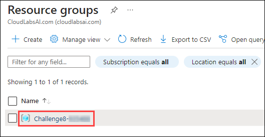

## Challenge 8 : Contoso Web App Hosting with Azure App Service

### **Contoso Environment:** 
1. The Contoso environment consists of an Azure subscription with contributor permissions.

1. To access the Azure portal, open a private/incognito window in your browser and navigate to **[Azure Portal](https://portal.azure.com)**.

1. On the **Sign in to Microsoft Azure** tab you will see a login screen, enter the following email/username and then click on **Next**. 
   * Email/Username: <inject key="AzureAdUserEmail"></inject>
   
     
     
1. Now enter the following password and click on **Sign in**.
   * Password: <inject key="AzureAdUserPassword"></inject>
   
     
     
1. If you see the pop-up **Stay Signed in?**, click No.

1. If you see the pop-up **You have free Azure Advisor recommendations!**, close the window to continue the lab.

1. If a **Welcome to Microsoft Azure** popup window appears, click **Maybe Later** to skip the tour.
   
1. Now you will see Azure Portal Dashboard, click on **Resource groups** from the Navigate panel to see the resource groups.

    
   
1. Confirm you have a resource group **Challenge8** present as shown in the below screenshot. You need to use the **Challenge8** resource group through out this challenge.

    

### **Level:** Advanced 

### **Challenge Objective:**

Contoso E-commerce is a company that sells products online. They have a website hosted on an on-premises server, but they want to move it to Azure to take advantage of the cloud benefits. As an Azure administrator, your task is to migrate the website to Azure and make sure it is secure and scalable. Your development has provided you the required application code and have tasked you to deploy this on Azure using PaaS Services.

#### Requirements:

1. Create an App Service plan named "ContosoWebPlan" in the West US region with a Standard tier and one instance.

1. Configure scaling settings in the App Service plan to automatically scale up to three instances when the CPU usage is above 70% for five minutes.

1. Create an App Service named "ContosoWebApp" in the same App Service plan with the following settings:
   - Runtime stack: .NET
   - Operating system: Windows
   - Region: West US

1. Deploy the Web Application Code to the newly created app service, by following FTP method. 

1. Secure the App Service by:
   - Enabling HTTPS only traffic

1. Configure backup for the App Service to back up the web app daily at 1:00 AM to a storage account named "ContosoBackupunqiuestring".

### Success Criteria:

1. App Service plan "ContosoPlan" is created with the specified settings.

1. Scaling settings are configured as described and tested by simulating high CPU usage.

1. App Service "ContosoWebApp" is created with the specified settings.

1. Custom domain names are configured as described and the website is accessible using both domain names.

1. HTTPS only traffic is enabled.

1. Backup is configured as described, and a backup is successfully created and stored in the "ContosoBackup" storage account.

### Lab Validation

1. After completing the challenge, you need to visit the **Lab Validation (1)** tab and click on the **VALIDATE (2)** button under Actions to perform the validation steps. Verify that you have met the success criteria of the challenge. 

    

1. If the validation status displays **Success** for all the validation steps, **congratulations!**. This means that you have successfully completed the challenge. 

     
     
1. If the validation status displays **Fail**, **don't worry!** This could mean that you did not perform the challenge correctly.

     

1. Hover your mouse over the `i` **(1)** icon to see the error message and determine the root cause of the failure. Based on the error message, revisit the challenge as necessary, and redo the validation by clicking on the **VALIDATE (3)** button again.
      
      

1. If you are still having trouble, you can reach out to the support team via `labs-support@spektrasystems.com` for further assistance. The support team is available to help you to troubleshoot and resolve any technical issues or validation issues that may arise while the lab environment is live.
