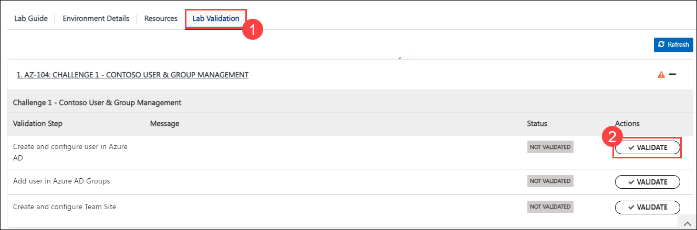

## Challenge 1 : Contoso User & Group Management

### **Contoso Environment:** 

1. The Contoso environment consists of an Azure AD tenant with an account having Global Admin rights. 

1. To access the Azure portal, open a private/incognito window in your browser and navigate to **[Azure Portal](https://portal.azure.com)**.

1. On the **Sign in to Microsoft Azure** tab you will see a login screen, enter the following email/username and then click on **Next**. 
   * Email/Username: <inject key="AzureAdUserEmail"></inject>
   
     
     
1. Now enter the following password and click on **Sign in**.
   * Password: <inject key="AzureAdUserPassword"></inject>
   
     
     
1. If you see the pop-up **Stay Signed in?**, click No

1. If you see the pop-up **You have free Azure Advisor recommendations!**, close the window to continue the lab.

1. If a **Welcome to Microsoft Azure** popup window appears, click **Maybe Later** to skip the tour.
  
### **Level:** Intermediate 

### **Challenge Objective:**

1. Create a new user in Azure AD named "John Smith" with a password that meets the company's password policy. John’s department is 
“Sales”, Office location is “Seattle”.

1. Assign the user a license for accessing emails, teams, SharePoint, have ability to reset their own password and must support using dynamic 
group membership.

1. John must be able to reset his own password using Authenticator App. 

1. John must be added to an Azure AD Group called “Sales-AllTeam” automatically without any manual intervention.

1. John must be added to an Azure AD Group called “Sales-SeattleTeam” automatically without any manual intervention.

1. John will create a new Teams Site named “Marketing-VendorFiles” and must invite marketing vendor Ron (ron-testuser@outlook.com) user to 
participate in file sharing via teams.

### Success Criteria:

1. Create and configure User to an Azure AD tenant.

1. Create and configure Azure AD Group.

1. Create and configure Teams site.

### Lab Validation

1. After completing the challenge, you need to visit the **Lab Validation (1)** tab and click on the **VALIDATE (2)** button under Actions to perform the validation steps. Verify that you have met the success criteria of the challenge. 

    

1. If the validation status displays **Success** for all the validation steps, **congratulations!**. This means that you have successfully completed the challenge. 

     
     
1. If the validation status displays **Fail**, **don't worry!** This could mean that you did not perform the challenge correctly.

     

1. Hover your mouse over the `i` **(1)** icon to see the error message and determine the root cause of the failure. Based on the error message, revisit the challenge as necessary, and redo the validation by clicking on the **VALIDATE (3)** button again.
      
      

1. If you are still having trouble, you can reach out to the support team via `labs-support@spektrasystems.com` for further assistance. The support team is available to help you to troubleshoot and resolve any technical issues or validation issues that may arise while the lab environment is live.

