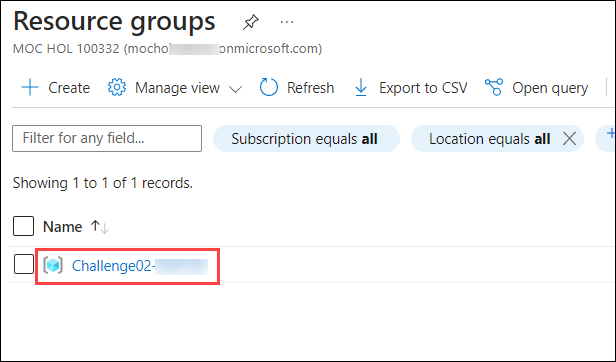
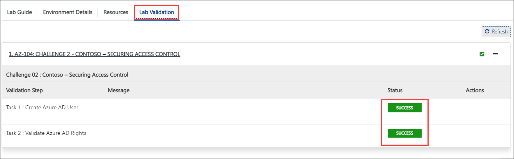
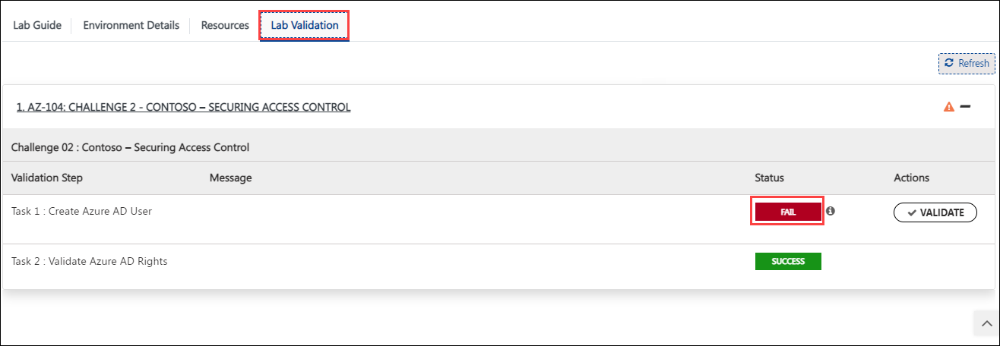
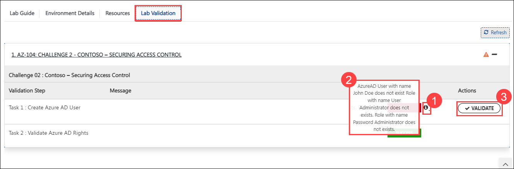

## Challenge 2 : Contoso – Securing Access Control

### **Contoso Environment:** 

1. The Contoso environment consists of an Azure AD tenant with an account having Global Admin rights. 

1. To access the Azure portal, open a private/incognito window in your browser and navigate to **[Azure Portal](https://portal.azure.com)**.

1. On the **Sign in to Microsoft Azure** tab you will see a login screen, enter the following email/username and then click on **Next**. 
   * Email/Username: <inject key="AzureAdUserEmail"></inject>
   
     
     
1. Now enter the following password and click on **Sign in**.
   * Password: <inject key="AzureAdUserPassword"></inject>
   
     
     
1. If you see the pop-up **Stay Signed in?**, click No

1. If you see the pop-up **You have free Azure Advisor recommendations!**, close the window to continue the lab.

1. If a **Welcome to Microsoft Azure** popup window appears, click **Maybe Later** to skip the tour.

1. Now you will see Azure Portal Dashboard, click on **Resource groups** from the Navigate panel to see the resource groups.

    
   
1. Confirm you have a resource group **Challenge02-SUFFIX** present as shown in the below screenshot. You need to use the **Challenge02-SUFFIX** resource group through out the challenge.

    

### **Challenge Objective:**

1. You have a new team member named “John Doe” joining your team as an Azure AD Administrator. Their Azure AD account is already created as part of onboarding process. 
  
2. You need to assign them following permissions in most secure fashion.   
   
   - Azure AD rights.
   - Ability to Create Users.
   - Ability to Create and Update Groups.
   - Ability to invite Guest Users.
   - Ability to reset password.
   - Ability to add application registrations.
   - Ability to manage Licenses.
   
3. You need to assign the following permissions at Subscription level.

   - Must have Reader access on Azure subscription named “Test-Dev”.
   - Must be able to start/stop Virtual machines hosted in the subscription.
   - subscriptions across all resource groups.
   - Must be able to create virtual machines and dependent in a resource group named “John-Doe-Test-RG”.

4. You need to ensure following guidelines while completing these 
challenges. 

   - Must follow the principal of least privilege. 
   - Permissions must not be assigned to user accounts directly.
   - Permissions must not be duplicated at various scopes. 
   - Only you, John Doe, admin@cloudlabs and cloudlabs-spn can have access to Azure AD. Any other access must be removed. 

### Success Criteria:

1. Create and configure Azure AD tenant.

1. Create and configure Azure Subscription.

### Lab Validation

1. After completing the challenge, you need to visit the **Lab Validation (1)** tab and click on the **VALIDATE (2)** button under Actions to perform the validation steps. Verify that you have met the success criteria of the challenge. 

    

1. If the validation status displays **Success** for all the validation steps, **congratulations!**. This means that you have successfully completed the challenge. 

     
     
1. If the validation status displays **Fail**, **don't worry!** This could mean that you did not perform the challenge correctly.

     

1. Hover your mouse over the `i` **(1)** icon to see the error message and determine the root cause of the failure. Based on the error message, revisit the challenge as necessary, and redo the validation by clicking on the **VALIDATE (3)** button again.
      
      

1. If you are still having trouble, you can reach out to the support team via `labs-support@spektrasystems.com` for further assistance. The support team is available to help you to troubleshoot and resolve any technical issues or validation issues that may arise while the lab environment is live.

       
