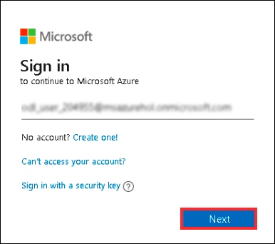
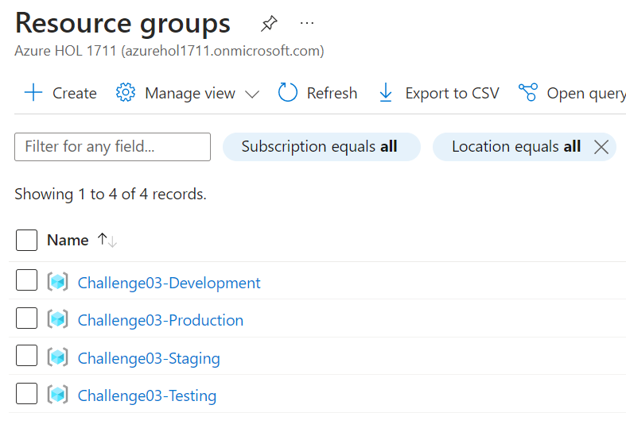
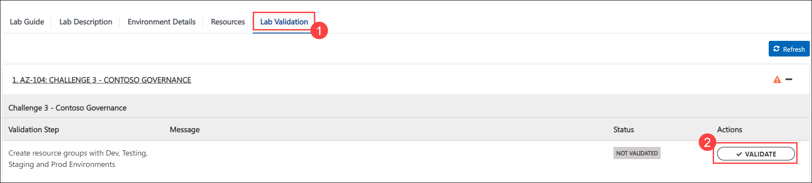
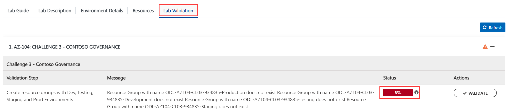
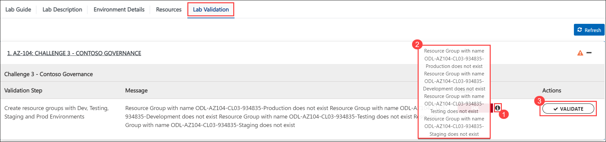

## Challenge 3 : Contoso - Governance

### **Contoso Environment:** 

1. The Contoso environment consists of an Azure AD tenant with an account having Global Admin rights and a bunch of pre-provisioned resource groups.

1. To access the Azure portal, open a private/incognito window in your browser and navigate to **[Azure Portal](https://portal.azure.com)**.

1. On the **Sign in to Microsoft Azure** tab you will see a login screen, enter the following email/username and then click on **Next**. 
   * Email/Username: <inject key="AzureAdUserEmail"></inject>
   
     
     
1. Now enter the following password and click on **Sign in**.
   * Password: <inject key="AzureAdUserPassword"></inject>
   
     
     
1. If you see the pop-up **Stay Signed in?**, click No.

1. If you see the pop-up **You have free Azure Advisor recommendations!**, close the window to continue the lab.

1. If a **Welcome to Microsoft Azure** popup window appears, click **Maybe Later** to skip the tour.

1. Now you will see Azure Portal Dashboard, click on **Resource groups** from the Navigate panel to see the resource groups.

    
   
1. Confirm you have the resource groups **Challenge03-Development**, **Challenge03-Production**, **Challenge03-Staging** and **Challenge03-Testing** present as shown in the below screenshot. You need to use these resource groups in order to execute this challenge.

    

### **Challenge Objective:**

1. Your environment includes certain resource groups for production and development workloads. 
  
2. You are tasked to ensure:

    1. Any existing RGs must have following tags:
        - Environmental: Test/Dev/Production/Staging.
        - Owner: Your email address.

    2. You need to ensure that no resource groups can be created in future without the above listed tags.
    
    3. You need to ensure that any resource groups having production in name can not be deleted accidently.
   
### Success Criteria:

1. Presence of tags.

1. Creation of policy assignments.

1. Creation of a lock.

### Lab Validation

1. After completing the challenge, you need to visit the **Lab Validation (1)** tab and click on the **VALIDATE (2)** button under Actions to perform the validation steps. Verify that you have met the success criteria of the challenge. 

    

1. If the validation status displays **Success** for all the validation steps, **congratulations!**. This means that you have successfully completed the challenge. 

     
     
1. If the validation status displays **Fail**, **don't worry!** This could mean that you did not perform the challenge correctly.

     

1. Hover your mouse over the `i` **(1)** icon to see the error message and determine the root cause of the failure. Based on the error message, revisit the challenge as necessary, and redo the validation by clicking on the **VALIDATE (3)** button again.
      
      

1. If you are still having trouble, you can reach out to the support team via `labs-support@spektrasystems.com` for further assistance. The support team is available to help you to troubleshoot and resolve any technical issues or validation issues that may arise while the lab environment is live.

