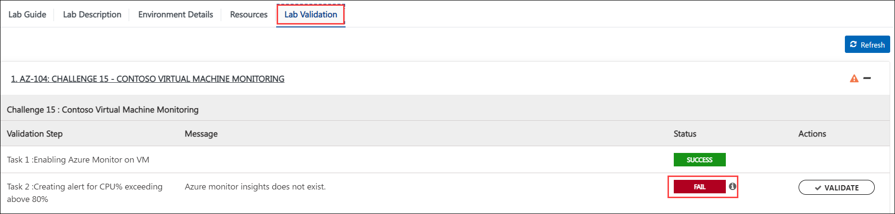

## Challenge 15 : Contoso Virtual Machine Monitoring 

### **Contoso Environment:** 

1. The Contoso environment consists of an Azure **subscription** with **contributor** permissions, a pre-configured Contoso virtual machine and a resource group with the name **Challenge15**.

1. To access the Azure portal, open a private/incognito window in your browser and navigate to **[Azure Portal](https://portal.azure.com)**.

1. On the **Sign in to Microsoft Azure** tab you will see a login screen, enter the following email/username and then click on **Next**. 
   * Email/Username: <inject key="AzureAdUserEmail"></inject>
   
     
     
1. Now enter the following password and click on **Sign in**.
   * Password: <inject key="AzureAdUserPassword"></inject>
   
     
     
1. If you see the pop-up **Stay Signed in?** click No.

1. If you see the pop-up **You have free Azure Advisor recommendations!**, close the window to continue the lab.

1. If a **Welcome to Microsoft Azure** popup window appears, click **Maybe Later** to skip the tour.
   
1. Now you will see Azure Portal Dashboard, click on **Resource groups** from the Navigate panel to see the resource groups.

    
   
1. Confirm you have a resource group **Challenge15** present as shown in the below screenshot. You need to use the **Challenge15** resource group through out this challenge.

    

### **Level:** Intermediate 

### **Challenge Objective:**

Contoso is a cloud-based company that relies heavily on virtual machines (VMs) to run their services. They need to monitor their VMs for performance issues and take action if necessary.

#### Requirements:

1. Set up Azure Monitor to monitor the CPU usage of all Contoso VMs.

1. Configure an alert that triggers when the CPU usage exceeds 80% for 5 minutes.
 
1. Configure an action to send an email notification to the Contoso IT team when the alert is triggered.

1. Use VM insights to monitor network traffic to and from the VMs.

1. Query logs to find any errors in VM events and notify Contoso IT Team.

### Success criteria:

1. The CPU usage of all VMs is being monitored.

1. An alert triggers when CPU usage exceeds 80% for 5 minutes.

1. The IT team receives an email notification when the alert is triggered.

1. Network traffic to and from the VMs are being monitored.

1. The IT team receives an email notification when any errors are logged in Azure Monitor.

### Lab Validation:

1. After completing the challenge, you need to visit the **Lab Validation (1)** tab and click on the **VALIDATE (2)** button under Actions to perform the validation steps. Verify that you have met the success criteria of the challenge. 

    

1. If the validation status displays **Success** for all the validation steps, **congratulations!** This means that you have successfully completed the challenge. 

     
     
1. If the validation status displays **Fail**, **don't worry!** This could mean that you did not perform the challenge correctly.

     

1. Hover your mouse over the `i` **(1)** icon to see the error message and determine the root cause of the failure. Based on the error message, revisit the challenge as necessary, and redo the validation by clicking on the **VALIDATE (3)** button again.
      
      

1. If you are still having trouble, you can reach out to the support team via `labs-support@spektrasystems.com` for further assistance. The support team is available to help you to troubleshoot and resolve any technical issues or validation issues that may arise while the lab environment is live.
