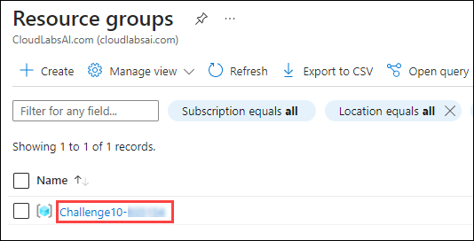
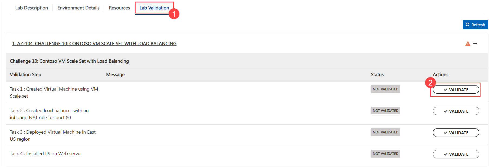
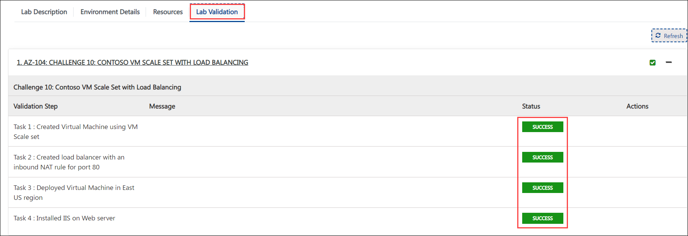
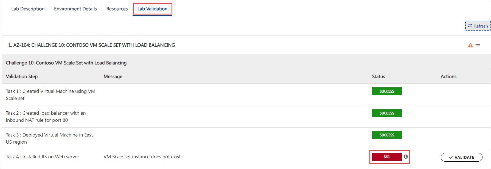
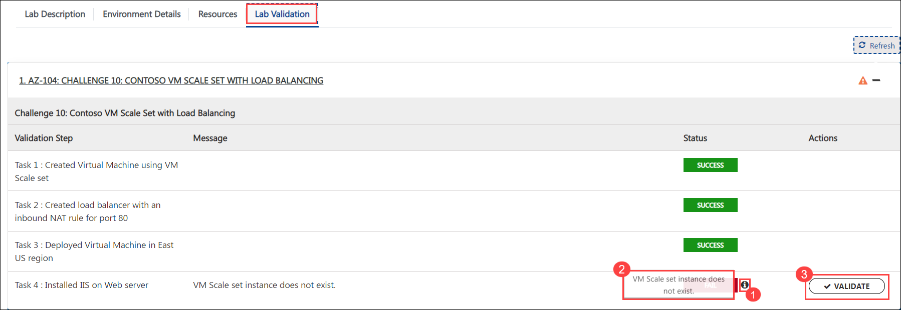

## Challenge 11: Contoso VM Network Monitoring

### **Contoso Environment:** 

1. The Contoso environment consists of an Azure **subscription** with **contributor** permissions, a pre-configured Contoso virtual machine with the name **Contosovm<inject key="DeploymentID" enableCopy="false"/>**, and a few pre-provisioned resource groups.

1. To access the Azure portal, open a private/incognito window in your browser and navigate to **[Azure Portal](https://portal.azure.com)**.

1. On the **Sign in to Microsoft Azure** tab you will see a login screen, enter the following email/username and then click on **Next**. 
   * Email/Username: <inject key="AzureAdUserEmail"></inject>
   
     
     
1. Now enter the following password and click on **Sign in**.
   * Password: <inject key="AzureAdUserPassword"></inject>
   
     
     
1. If you see the pop-up **Stay Signed in?**, click No.

1. If you see the pop-up **You have free Azure Advisor recommendations!**, close the window to continue the lab.

1. If a **Welcome to Microsoft Azure** popup window appears, click **Maybe Later** to skip the tour.
   
1. Now you will see Azure Portal Dashboard, click on **Resource groups** from the Navigate panel to see the resource groups.

    
   
1. Confirm you have a resource group **Challenge11** present as shown in the below screenshot. You need to use the **Challenge11** resource group through out this challenge.

    

### **Level:** Intermediate 

### **Challenge Objective:**

#### Requirements:

Contoso Ltd. has a mission-critical application hosted on an Azure virtual machine. The application is accessed by employees and customers from different regions around the world. The IT team wants to ensure that the application's network connectivity is monitored and any issues are resolved quickly to avoid any downtime.

#### Challenge Tasks:

1. Configure monitoring for the virtual network for any anomalies and detect any changes in network traffic patterns.

1. Set up required NSG rules to control inbound and outbound traffic to the virtual machine running the application, it must not allow anything outside port 443.

1. Create alerts whenever network bandwidth goes beyond 10MB in 5 minutes interval and notify `ssit@spektrasystems.com`.

### Success Criteria:

1. Network security group rules are set up to control inbound and outbound traffic to the virtual machine running the application.

1. Azure Monitor alerts are created based on custom network metrics and thresholds.

### Lab Validation

1. After completing the challenge, you need to visit the **Lab Validation (1)** tab and click on the **VALIDATE (2)** button under Actions to perform the validation steps. Verify that you have met the success criteria of the challenge. 

    

1. If the validation status displays **Success** for all the validation steps, **congratulations!** This means that you have successfully completed the challenge. 

     
     
1. If the validation status displays **Fail**, **don't worry!** This could mean that you did not perform the challenge correctly.

     

1. Hover your mouse over the `i` **(1)** icon to see the error message and determine the root cause of the failure. Based on the error message, revisit the challenge as necessary, and redo the validation by clicking on the **VALIDATE (3)** button again.
      
      

1. If you are still having trouble, you can reach out to the support team via `labs-support@spektrasystems.com` for further assistance. The support team is available to help you to troubleshoot and resolve any technical issues or validation issues that may arise while the lab environment is live.
