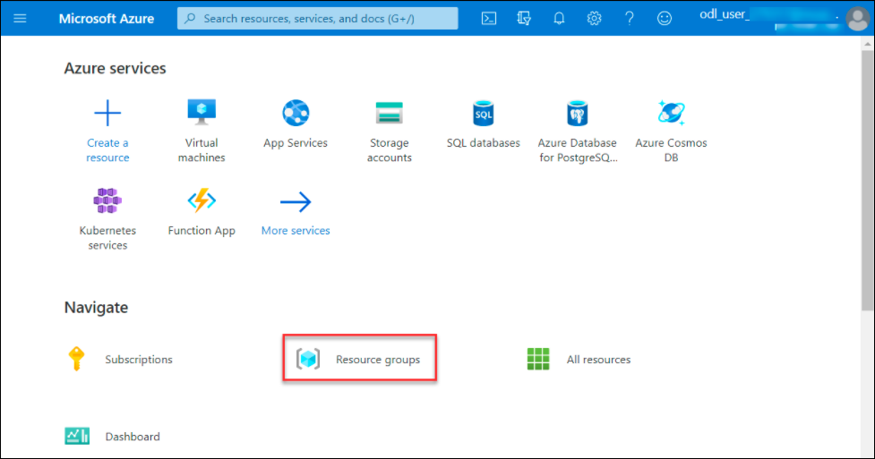
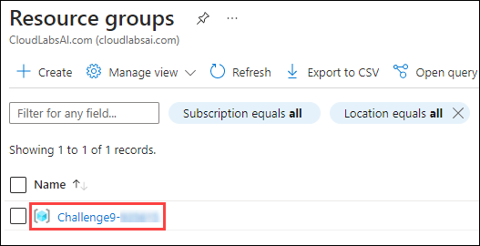
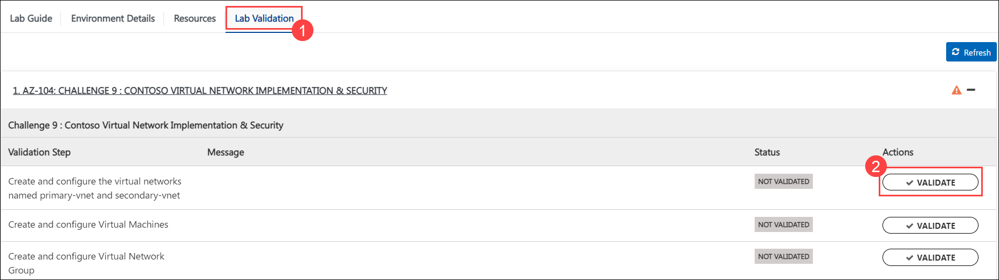
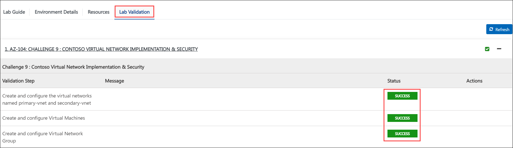
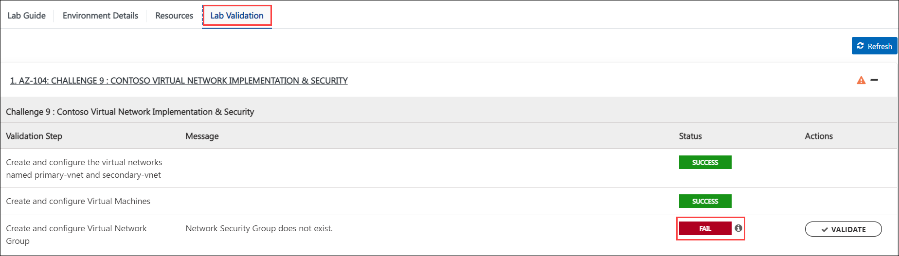
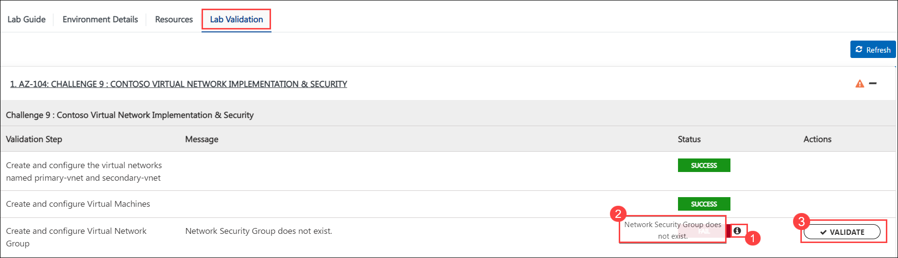

## Challenge 9 : Contoso Virtual Network Implementation & Security

### **Contoso Environment:** 

1. The Contoso environment consists of an Azure subscription with contributor permissions.

1. To access the Azure portal, open a private/incognito window in your browser and navigate to **[Azure Portal](https://portal.azure.com)**.

1. On the **Sign in to Microsoft Azure** tab you will see a login screen, enter the following email/username and then click on **Next**. 
   * Email/Username: <inject key="AzureAdUserEmail"></inject>
   
     
     
1. Now enter the following password and click on **Sign in**.
   * Password: <inject key="AzureAdUserPassword"></inject>
   
     
     
1. If you see the pop-up **Stay Signed in?**, click No.

1. If you see the pop-up **You have free Azure Advisor recommendations!**, close the window to continue the lab.

1. If a **Welcome to Microsoft Azure** popup window appears, click **Maybe Later** to skip the tour.
   
1. Now you will see Azure Portal Dashboard, click on **Resource groups** from the Navigate panel to see the resource groups.

    
   
1. Confirm you have a resource group **Challenge9-<inject key="DeploymentID" enableCopy="false"/>** present as shown in the below screenshot. You need to use the **Challenge9-<inject key="DeploymentID" enableCopy="false"/>** resource group through out this challenge.

    

### **Level:** Intermediate 

### **Challenge Objective:**

#### Requirement:

Contoso Corp is a multinational company that specializes in the development of cutting-edge technologies. The company has recently expanded its operations to the cloud and has migrated several critical applications to Azure. As a result, they need a highly secure and resilient virtual network infrastructure to support their cloud-based applications.

#### Challenge:

Your task is to design and configure a highly secure and resilient virtual network infrastructure for Contoso Corp. The virtual network should have the following requirements:

1. The virtual network named “primary-vnet” in East US region should be divided into two subnets: one for the primary-application and another for the primary-database. The application subnet should have a CIDR block of 10.0.0.0/24, and the database subnet should have a CIDR block of 10.0.1.0/24. The VNET CIDR must support adding atleast 60 subnets in future with /24 range.

1. The virtual network named “secondary-vnet” in West US region should be divided into two subnets: one for the secondary-application and another for the secondary-database. The application subnet should have a CIDR block of 10.20.0.0/24, and the database subnet should have a CIDR block of 10.20.1.0/24. The VNET CIDR must support adding atleast 60 subnets in future with /24 range. 

1. Virtual machines between secondary-database and primary-database must be able to communicate with each other over private IPs without going through public IP address. 

1. Virtual machines in primary-vnet must not be allowing RDP 3389 port from any source. You must implement an alternate method for RDP which does not require exposing RDP 3389 port, both internally and externally. 

1. The virtual machines in the primary-application subnet must be able to access a blob storage account named “appstorageSUFFIX” securely by private network without going through internet. 

1. The virtual network should have a network security group (NSG) associated with the all subnets. The NSG should have the any rules except than required for this setup.

### Success Criteria:

1. The virtual network should be configured according to the requirements listed above.

1. The virtual network peering should be established successfully, and the primary-vnet should be accessible from the secondary-vnet

1. Virtual machines in the application subnet should be accessible via RDP through the Bastion host.

1. The private endpoint for Azure Storage should be accessible from the virtual machines in the application subnet.

1. The NSG should be configured correctly, with minimum rules.

 > All above listed requirements must be met.

### Lab Validation

1. After completing the challenge, you need to visit the **Lab Validation (1)** tab and click on the **VALIDATE (2)** button under Actions to perform the validation steps. Verify that you have met the success criteria of the challenge. 

    

1. If the validation status displays **Success** for all the validation steps, **congratulations!**. This means that you have successfully completed the challenge. 

     
     
1. If the validation status displays **Fail**, **don't worry!** This could mean that you did not perform the challenge correctly.

     

1. Hover your mouse over the `i` **(1)** icon to see the error message and determine the root cause of the failure. Based on the error message, revisit the challenge as necessary, and redo the validation by clicking on the **VALIDATE (3)** button again.
      
      

1. If you are still having trouble, you can reach out to the support team via `labs-support@spektrasystems.com` for further assistance. The support team is available to help you to troubleshoot and resolve any technical issues or validation issues that may arise while the lab environment is live.
