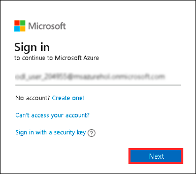
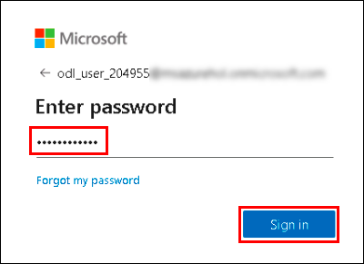

## Challenge 12: Contoso Company Data Migration and Archiving

### **Contoso Environment:** 

1. The Contoso environment consists of an Azure **subscription** with **contributor** permissions and a pre-provisioned resource group.

1. To access the Azure portal, open a private/incognito window in your browser and navigate to **[Azure Portal](https://portal.azure.com)**.

1. On the **Sign in to Microsoft Azure** tab you will see a login screen, enter the following email/username and then click on **Next**. 
   * Email/Username: <inject key="AzureAdUserEmail"></inject>
   
     
     
1. Now enter the following password and click on **Sign in**.
   * Password: <inject key="AzureAdUserPassword"></inject>
   
     
     
1. If you see the pop-up **Stay Signed in?**, click No.

1. If you see the pop-up **You have free Azure Advisor recommendations!**, close the window to continue the lab.

1. If a **Welcome to Microsoft Azure** popup window appears, click **Maybe Later** to skip the tour.
   
1. Now you will see Azure Portal Dashboard, click on **Resource groups** from the Navigate panel to see the resource groups.

    
   
1. Confirm you have a resource group **Challenge12-<inject key="DeploymentID" enableCopy="false"/>** present as shown in the below screenshot. You need to use the **Challenge12-<inject key="DeploymentID" enableCopy="false"/>** resource group through out this challenge.

    

### **Level:** Advanced 

### **Challenge Objective:**

#### Requirements:

Contoso Company has a large amount of data that needs to be archived to Azure Blob Storage. Contoso Company needs to migrate their data from an on-premises storage solution to Azure.

#### Challenge Tasks:

1. Create and configure a storage account and generate shared access signature tokens.

1. Configure stored access policies, and manage access keys to enable data migration.

1. Once the data is migrated, your challenge is to configure the storage tiers and lifecycle management policies to optimize the cost of data storage which must be encrypted.

### Success Criteria:

1. Create an Azure Blob Storage account and generate SAS tokens to enable secure access to the storage account.

1. Configure stored access policies to control the types of operations that can be performed on the storage account.

1. Perform sample data migration using AzCopy.

1. Configure storage tiers to store the data in the most cost-effective way with lifecycle management policies enabled to automatically move the data to a lower cost storage tier or delete it.

1. Configure storage encryption to secure the data stored in Azure.

### Lab Validation

1. After completing the challenge, you need to visit the **Lab Validation (1)** tab and click on the **VALIDATE (2)** button under Actions to perform the validation steps. Verify that you have met the success criteria of the challenge. 

    

1. If the validation status displays **Success** for all the validation steps, **congratulations!** This means that you have successfully completed the challenge. 

     
     
1. If the validation status displays **Fail**, **don't worry!** This could mean that you did not perform the challenge correctly.

     

1. Hover your mouse over the `i` **(1)** icon to see the error message and determine the root cause of the failure. Based on the error message, revisit the challenge as necessary, and redo the validation by clicking on the **VALIDATE (3)** button again.
      
      

1. If you are still having trouble, you can reach out to the support team via `labs-support@spektrasystems.com` for further assistance. The support team is available to help you to troubleshoot and resolve any technical issues or validation issues that may arise while the lab environment is live.
